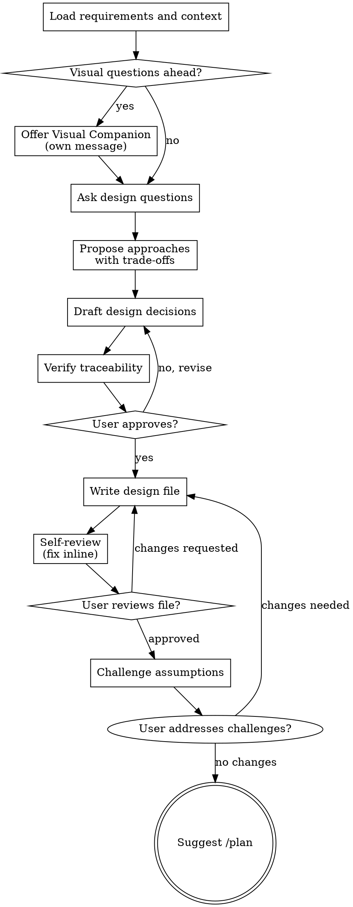

# Design Spec

This skill helps make and capture technical design decisions for a feature area through collaborative dialogue. It reads the user requirements from `docs/requirements/<topic>.md` and produces a design spec in `docs/design/<topic>.md` where every decision is traced back to specific requirement numbers.

The focus is on the "how" from an engineering perspective: technology choices, data flow, caching strategies, module boundaries, trade-offs, and integration points.

Argument: `$ARGUMENTS`

<HARD-GATE>
Do NOT write any code, scaffold any project, or take any implementation action. This skill produces a design document, not code. Implementation happens through the plan skill.
</HARD-GATE>

## Checklist

You MUST create a task for each of these items and complete them in order:

1. **Load requirements and context** - read the requirements file, existing design files, relevant codebase
2. **Offer visual companion** (if the topic involves architecture diagrams or UI structure) - this is its own message
3. **Ask design questions** - one at a time, explore technology choices and trade-offs per requirement
4. **Propose 2-3 approaches** - for each non-obvious decision, with trade-offs and your recommendation
5. **Draft design decisions** - present decisions for user approval, section by section
6. **Verify traceability** - every requirement must be addressed by at least one decision
7. **Write design file** - save to `docs/design/<topic>.md`
8. **Self-review** - check for placeholders, contradictions, traceability gaps
9. **User reviews written design** - ask user to review the file before proceeding
10. **Challenge assumptions** - stress-test the design decisions against codebase evidence and logic
11. **Suggest next step** - point user to `/plan <initiative>`

## Process Flow



## Loading context

1. Find and read `docs/requirements/<topic>.md` where `<topic>` matches `$ARGUMENTS`. If the file does not exist, tell the user to run `/requirements <topic>` first and stop.
2. Read `docs/index.md` and any existing design files in `docs/design/` for context on what has already been decided.
3. If `docs/design/<topic>.md` already exists, read it so you understand what decisions have been captured. You will be updating it, not replacing it.
4. Explore the relevant parts of the codebase to understand the current architecture. Use Glob and Grep to find models, views, serializers, services, and tests related to the topic.

## Exploring design decisions

For each requirement (or group of related requirements), discuss the technical approach with the user. Ask questions one at a time, focusing on:

- **How should this be implemented?** What components, services, or modules are involved?
- **What are the trade-offs?** When there is a genuine choice to make, propose 2-3 approaches with pros and cons. Lead with your recommendation and explain why.
- **What technology-specific constraints apply?** Consider caching, performance, database schema, API contracts, third-party integrations, and existing infrastructure.
- **How does this interact with existing code?** What needs to change, what can be reused, and what should be extracted or refactored?

Always reference the requirement numbers you are addressing. For example: "For requirements 3 and 4, we need to decide how to handle permissions. Here are three options..."

Prefer multiple choice questions when possible, but open-ended questions are fine too. Ask all questions in a single numbered batch so the user can answer them in one pass.

**Design for a single source of truth:**
- Every piece of data, logic, or configuration should be defined in exactly one place. If two components need the same value or rule, one must derive it from the other.
- Watch for decisions that would split a source of truth: duplicated constants, repeated validation rules, business logic in both the caller and the callee, or the same configuration in multiple files. When a fact changes, only one place should need to be updated.
- Prefer computed or derived values over stored duplicates. If a value can be calculated from existing data, do not store it separately.

**Design for isolation and clarity:**
- Break the system into smaller units that each have one clear purpose and communicate through well-defined interfaces.
- For each unit, you should be able to answer: what does it do, how do you use it, and what does it depend on?
- Smaller, well-bounded units are easier to implement, test, and reason about. When a component grows large, that is often a signal that it is doing too much.

**Working in existing codebases:**
- Explore the current structure before proposing changes. Follow existing patterns.
- Where existing code has problems that affect the work (e.g., a file that has grown too large, unclear boundaries, tangled responsibilities), include targeted improvements as part of the design.
- Do not propose unrelated refactoring. Stay focused on what serves the current requirements.

## Drafting the design

Once you have discussed the key decisions, draft the design spec and present it to the user. Scale each section to its complexity: a few sentences if straightforward, up to 200-300 words if nuanced. Ask after each section whether it looks right so far.

Use this format for the file:

```markdown
# <Feature Area> Design Spec

Last updated: YYYY-MM-DD
Requirements: docs/requirements/<topic>.md

## Context

<2-3 sentences about the current state of this area in the codebase and what is changing.>

## Decisions

### D1: <Short decision title>

**Addresses:** REQ 1, 3
**Decision:** <What was decided and why.>
**Trade-offs:** <What was considered and rejected, and why.>

### D2: <Short decision title>

**Addresses:** REQ 2, 4, 5
**Decision:** <What was decided and why.>
**Trade-offs:** <What was considered and rejected, and why.>
```

Each decision must:
- Have a sequential ID (D1, D2, D3, ...).
- Explicitly list which requirement numbers it addresses.
- Explain the decision clearly enough that someone could implement it without further questions.
- Include trade-offs only when a real alternative was considered. Do not fabricate trade-offs for obvious choices.

For deprecations and replacements:

```markdown
### ~~D3: Original decision title~~ DEPRECATED (YYYY-MM-DD)

Replaced by D3.1. Reason: <why it changed>.

### D3.1: New decision title

**Addresses:** REQ 7
**Decision:** <Updated decision.>
```

## Verifying traceability

Before writing the file, check that every requirement in `docs/requirements/<topic>.md` is addressed by at least one decision. If any requirement is not covered, flag it to the user and ask whether it should be addressed now or deferred to a later iteration.

## Writing the file

Save the approved design spec to `docs/design/<topic>.md`.

- If the file already exists, merge new decisions into it. Keep existing decision IDs stable and append new ones after the highest existing ID.
- If the file does not exist, create it.

## Self-review

After writing the file, review it with fresh eyes:

1. **Placeholder scan:** Are there any "TBD", "TODO", incomplete sections, or vague decisions? Fix them.
2. **Internal consistency:** Do any decisions contradict each other? Does the architecture hold together as a whole?
3. **Traceability check:** Does every requirement have at least one decision? Does every decision reference at least one requirement?
4. **Ambiguity check:** Could any decision be interpreted two different ways by an implementer? If so, make it explicit.
5. **Scope check:** Is this focused enough for implementation planning, or does it need to be split?

Fix any issues inline. No need to re-review, just fix and move on.

## User review gate

After the self-review passes, ask the user to review the written file:

> "Design spec captured in `docs/design/<topic>.md`. Please review the file and let me know if you want to make any changes before we move on to the implementation plan."

Wait for the user's response. If they request changes, make them and re-run the self-review. Only proceed once the user approves.

## Challenge assumptions

After the user approves the design, step back and actively stress-test the decisions. This is not a polish pass - it is a deliberate attempt to find flaws, hidden risks, and incorrect assumptions before they reach implementation.

Investigate the codebase, data model, existing tests, and domain context to ground each challenge in evidence. Look for:

- **Assumptions about the codebase that you haven't verified by reading the code.** For example, a decision assumes a service exists or an endpoint returns a certain shape, but does it?
- **Decisions that conflict with patterns already established in the project.** For example, introducing a new caching layer when the project already has a caching convention that would work.
- **Complexity that could be avoided by leveraging existing infrastructure differently.** For example, building a custom queue when Celery/Temporal is already available and fits the use case.
- **Hidden coupling between decisions** that could cause implementation friction. For example, D2 depends on D1 being implemented first, but neither mentions this dependency.
- **Performance or scaling concerns grounded in actual data model or query patterns.** For example, a decision proposes a JOIN across three tables, but the existing query patterns show that one of those tables has millions of rows with no relevant index.
- **Trade-offs that were dismissed too quickly.** For example, an alternative was rejected as "too complex," but the chosen approach actually requires more code or introduces more risk.

Present each challenge in this format:

> **Challenge N (DN):** "Decision DN assumes [assumption]. However, [evidence from codebase/domain/logic]. Consider [concrete suggestion]."

Number the challenges sequentially. Be specific - cite file paths, function names, model fields, or existing behavior. Do not raise vague concerns.

After presenting the challenges, ask the user which ones they want to act on. For any accepted challenges, update the design file and re-run the self-review. For rejected challenges, move on without changes.

## Next step

Update `docs/index.md` so the design file is listed under a "Design" section. Then tell the user:

> "When you are ready to plan the implementation, run `/plan <initiative-name>` to create an implementation plan that references these requirements and design decisions."

## Key principles

- **All questions at once.** Batch all clarifying questions into a single numbered list so the user can answer in one pass.
- **Multiple choice preferred.** It is easier to answer than open-ended when possible.
- **Always reference requirement numbers.** Every discussion should tie back to specific requirements.
- **Propose 2-3 approaches** only when there is a genuine choice. Do not fabricate alternatives for obvious decisions.
- **YAGNI ruthlessly.** If a design decision is not needed to satisfy a requirement, leave it out.
- **Traceability is mandatory.** Every requirement must be addressed. Every decision must reference requirements.
- **Numbers are stable.** Never renumber existing decisions when adding new ones.
- **Deprecations preserve history.** The original ID stays, the replacement gets a sub-number, and the reason is documented.
- **Incremental validation.** Present the draft section by section, get approval before moving on.
- **Be flexible.** Go back and clarify when something does not make sense.
- **Do not use em-dashes.** Use hyphens, commas, or parentheses instead.
