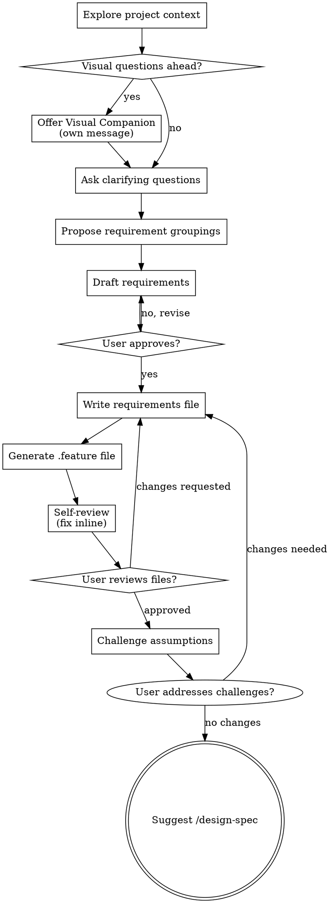

# Requirements

This skill helps turn a feature idea into structured, testable user requirements through collaborative dialogue. It produces numbered requirements stored in `docs/requirements/` that serve as the foundation for design specs (`/design-spec`) and implementation plans (`/plan`).

The focus is entirely on the "what and why" from the user and business perspective. Technology decisions belong in the design spec, not here.

Argument: `$ARGUMENTS`

<HARD-GATE>
Do NOT discuss technology choices, architecture, or implementation details. If the user brings them up, acknowledge their input but steer back to behavior and business needs. Those decisions belong in the design spec.
</HARD-GATE>

## Anti-Pattern: "This Is Too Simple To Need Requirements"

Every feature goes through this process. A small change, a config tweak, a single endpoint. "Simple" features are where unexamined assumptions cause the most wasted work. The requirements can be short (3-5 items for truly simple features), but you must capture them and get approval.

## Checklist

You MUST create a task for each of these items and complete them in order:

1. **Explore project context** - check existing requirements, docs, recent commits, and codebase
2. **Offer visual companion** (if the topic involves UI or visual behavior) - this is its own message, not combined with a clarifying question
3. **Ask clarifying questions** - one at a time, understand who/what/why/boundaries/failure modes
4. **Propose requirement groupings** - suggest how the requirements could be organized, with your recommendation
5. **Draft requirements** - present numbered requirements for user approval, section by section
6. **Write requirements file** - save to `docs/requirements/<topic>.md`
7. **Generate BDD feature file** - translate requirements into Gherkin scenarios
8. **Self-review** - check for placeholders, ambiguity, testability, and completeness
9. **User reviews written requirements** - ask user to review the file before proceeding
10. **Challenge assumptions** - stress-test the requirements against codebase evidence and logic
11. **Suggest next step** - point user to `/design-spec <topic>`

## Process Flow



## Understanding the feature

- Check the current project state first (existing requirements files, docs, recent commits, relevant code).
- If `$ARGUMENTS` contains a Linear ticket (e.g., `<TEAM>-123`), use the Linear MCP tools to fetch the issue details.
- If a requirements file for this topic already exists, read it so you understand what has been captured and avoid duplication.
- Before asking detailed questions, assess scope: if the request describes multiple independent feature areas, flag this immediately. Each area should get its own requirements file. Help the user decompose first, then start with the first area.
- If the project is too large for a single requirements file, help the user break it into sub-areas. Each sub-area gets its own file and its own brainstorming cycle.
- For appropriately-scoped features, ask questions one at a time to understand:
  - **Who** is affected? (Users, roles, external systems, regulatory bodies.)
  - **What** should the system do? (Observable behavior, expected outcomes.)
  - **Why** does this matter? (Business need, regulatory requirement, user pain, revenue impact.)
  - **What are the boundaries?** (What is explicitly out of scope for this feature?)
  - **What can go wrong?** (What happens if the requirement is violated? What are the edge cases? What breaks?)
- Prefer multiple choice questions when possible, but open-ended questions are fine too.
- Ask all clarifying questions in a single message so the user can answer them in one pass. Number each question clearly. If answers reveal new areas to explore, send a follow-up batch.
- Focus on understanding purpose, constraints, and success criteria.

## Organizing requirements

Before drafting, propose how the requirements should be grouped. If the feature naturally splits into sub-areas (e.g., "authorization" could split into "authorization-permissions" and "authorization-exports"), suggest that upfront.

- Present 2-3 grouping options with trade-offs if the split is not obvious.
- Lead with your recommended grouping and explain why.

## Drafting requirements

Once you have a clear picture, draft the requirements and present them to the user for review.

Each requirement must be:
- **Numbered sequentially** (1, 2, 3, ...). The file name acts as the namespace, so numbers are local to the file.
- **One sentence** describing an observable behavior or constraint.
- **Testable**, meaning someone could write a test or manually verify whether the system satisfies it.
- **Independent from technology choices.** "Users can export data as CSV" is good. "The system uses pandas to generate CSV" is not.

Use this format for the file:

```markdown
# <Feature Area> Requirements

Last updated: YYYY-MM-DD

## Context

<2-3 sentences explaining what this feature area is about and why it matters.>

## Requirements

1. <Requirement text.>
2. <Requirement text.>
3. <Requirement text.>
```

For deprecations and replacements, use this format:

```markdown
3. ~~Original requirement text.~~ DEPRECATED (YYYY-MM-DD): Replaced by 3.1. Reason: <why it changed>.
3.1. New requirement text that replaces the original.
```

Present the full draft to the user. Scale each section to its complexity: a few sentences if straightforward, more detail if nuanced. Ask after each section whether it looks right so far. Iterate until they approve.

## Writing the file

Save the approved requirements to `docs/requirements/<topic>.md` **inside the project directory** (not the top-level working directory). For example, if working on `code/myproject`, the path is `code/myproject/docs/requirements/<topic>.md`.

- If the file already exists, merge the new requirements into it. Keep existing numbers stable and append new ones after the highest existing number.
- If the file does not exist, create it.
- Keep the file small and focused. If you notice it is growing beyond 20-25 requirements, suggest splitting it into more specific files (e.g., `authorization-permissions.md` and `authorization-exports.md`). When splitting, numbers restart in each new file because the file name is the namespace.

## BDD feature file generation

After writing the requirements file, generate a `.feature` file that translates each requirement into one or more Gherkin scenarios:

```gherkin
Feature: <Feature Area>
  <Context from the requirements file.>

  # REQ 1
  Scenario: <Requirement 1 expressed as a user action and outcome>
    Given <precondition>
    When <action>
    Then <expected outcome>

  # REQ 2
  Scenario: <Requirement 2 expressed as a user action and outcome>
    Given <precondition>
    When <action>
    Then <expected outcome>
```

Each scenario must reference which requirement number it validates with a comment.

**Where to place the file:**
- If a BDD framework is detected in the project (behave, pytest-bdd, cucumber, or existing `.feature` files in a test directory), place the file in the project's existing BDD test structure (e.g., `features/<topic>.feature`).
- If no BDD framework is detected, place the file next to the requirements at `docs/requirements/<topic>.feature`.

## Self-review

After writing the files, review them with fresh eyes:

1. **Placeholder scan:** Are there any "TBD", "TODO", incomplete items, or vague requirements? Fix them.
2. **Testability check:** Could someone write a test for each requirement? If a requirement is too vague to test, make it more specific.
3. **Ambiguity check:** Could any requirement be interpreted two different ways? If so, pick one interpretation and make it explicit.
4. **Completeness check:** Do the requirements cover the happy path, the error cases, and the edge cases that were discussed? If anything is missing, add it.
5. **Scope check:** Are any requirements actually technology decisions in disguise? Move those to a note for the design spec.
6. **BDD alignment:** Does every requirement have at least one scenario in the feature file? Does every scenario map to a requirement?

Fix any issues inline. No need to re-review, just fix and move on.

## User review gate

After the self-review passes, ask the user to review the written files:

> "Requirements captured in `docs/requirements/<topic>.md`. Feature file generated at `<path>`. Please review and let me know if you want to make any changes before we move on to the design spec."

Wait for the user's response. If they request changes, make them and re-run the self-review. Only proceed once the user approves.

## File placement

All output files (requirements `.md` and `.feature` files) belong in the **project's own `docs/requirements/` directory**, not in the top-level `docs/` of the working directory. If the user is inside a sub-project (e.g., `<repo>/projects/<name>`), files go in `<repo>/projects/<name>/docs/requirements/`. Similarly, the `docs/index.md` to update is the project's index, not the top-level one. Always confirm which project you are working on and use its docs folder.

## Challenge assumptions

After the user approves the requirements, step back and actively stress-test them. This is not a polish pass - it is a deliberate attempt to find flaws, gaps, and incorrect assumptions before they propagate into design and implementation.

Investigate the codebase, data model, existing tests, and domain context to ground each challenge in evidence. Look for:

- **Unstated assumptions about user behavior or system state** that the codebase contradicts. For example, a requirement assumes a field is always present, but the model makes it nullable.
- **Requirements that sound right but don't match how the system actually works today.** For example, "users can filter by organization" when the current tenancy model already enforces this implicitly.
- **Missing failure modes** visible in existing error handling, retry logic, or edge-case tests.
- **Edge cases implied by the data model or existing tests** that the requirements don't cover (e.g., soft-deleted records, empty collections, concurrent modifications).
- **Scope that's too narrow or too broad** given what the codebase reveals. A requirement might ask for something that already exists, or might unknowingly require changes across multiple modules.

Present each challenge in this format:

> **Challenge N (REQ X):** "Requirement X assumes [assumption]. However, [evidence from codebase/domain/logic]. Consider [concrete suggestion]."

Number the challenges sequentially. Be specific - cite file paths, model fields, or existing behavior. Do not raise vague concerns.

After presenting the challenges, ask the user which ones they want to act on. For any accepted challenges, update the requirements file and re-run the self-review. For rejected challenges, move on without changes.

## Next step

Update the project's `docs/index.md` so the new requirements file is listed under a "Requirements" section. Then tell the user:

> "When you are ready to make technology and architecture decisions for these requirements, run `/design-spec <topic>`."

## Key principles

- **All questions at once.** Batch all clarifying questions into a single numbered list so the user can answer in one pass.
- **Multiple choice preferred.** It is easier to answer than open-ended when possible.
- **YAGNI ruthlessly.** If a requirement is not clearly needed, leave it out.
- **No technology.** Architecture, frameworks, and implementation details belong in the design spec.
- **Every requirement must be testable.** If you cannot write a test for it, it is too vague.
- **Keep files small.** Suggest splitting when they grow beyond 20-25 items.
- **Numbers are stable.** Never renumber existing requirements when adding new ones.
- **Deprecations preserve history.** The original number stays, the replacement gets a sub-number, and the reason is documented.
- **Incremental validation.** Present the draft section by section, get approval before moving on.
- **Be flexible.** Go back and clarify when something does not make sense.
- **Do not use em-dashes.** Use hyphens, commas, or parentheses instead.
